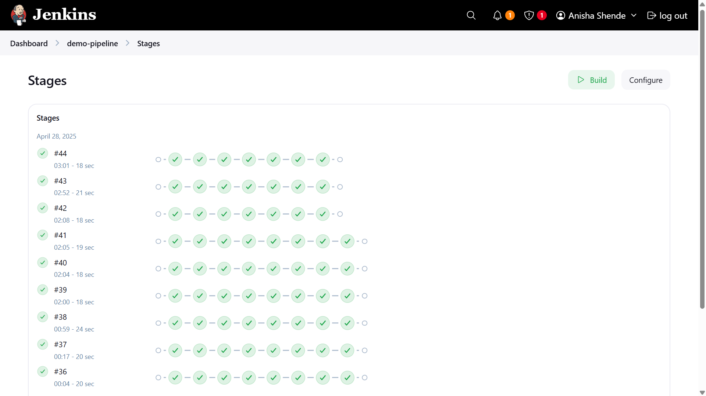
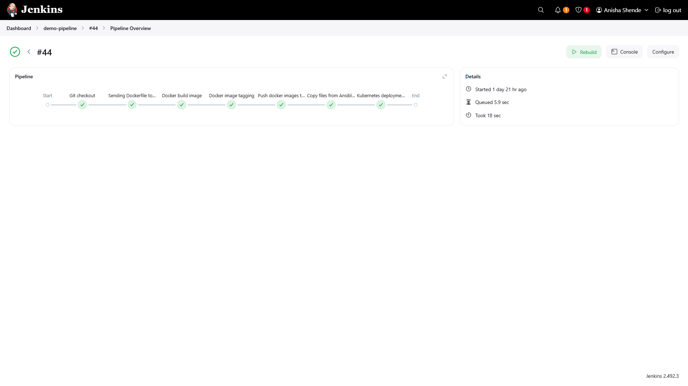
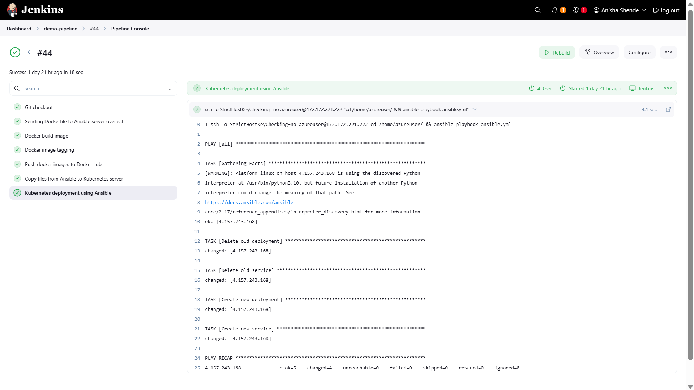
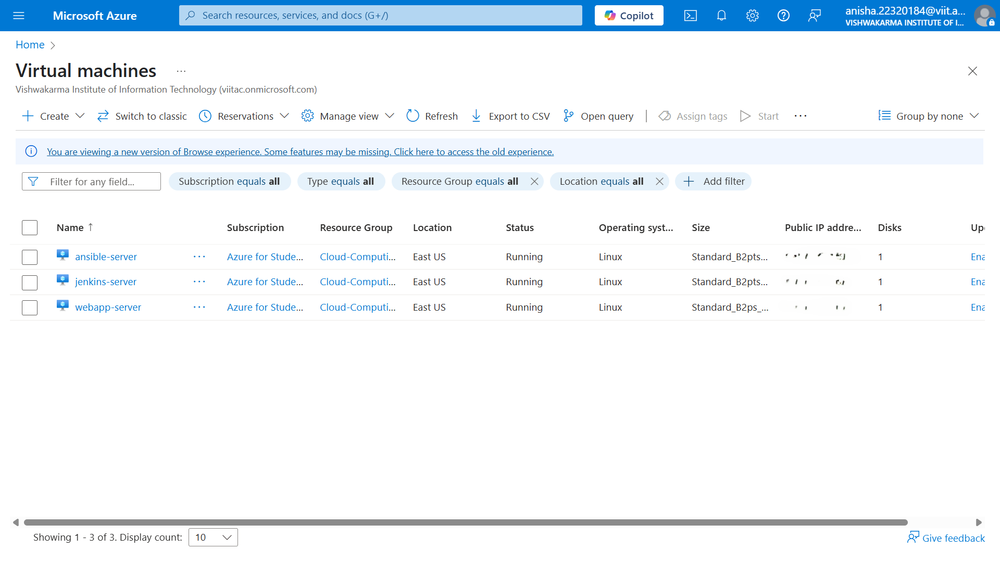
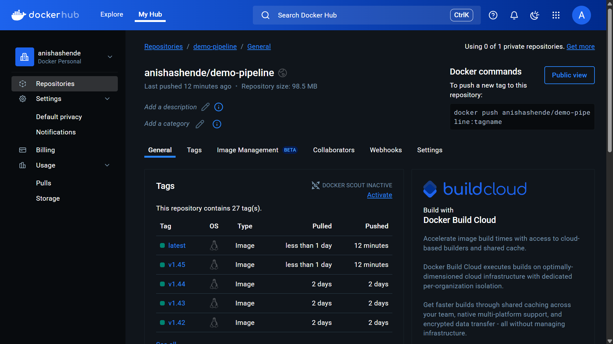

# 🚀 End-to-End CI/CD Deployment of a LLM Chatbot using Kubernetes

## 🛠️ Tech Stack
| Tool        | Purpose                                        |
|-------------|-------------------------------------------------|
| **GitHub**  | Code repository (source control)                |
| **Jenkins** | Continuous Integration & Orchestration          |
| **Ansible** | Automation (Server Configuration + Deployment)  |
| **Docker**  | Containerization of Application                 |
| **Kubernetes** | Container Orchestration & Deployment        |

---

## 🚀 Workflow Overview

1. **Code Development**  
   Developer writes the application code (a simple LLM-based chatbot).

2. **Push to GitHub**  
   Code is pushed to a GitHub repository with a configured webhook.

3. **Jenkins Build Triggered**  
   Jenkins fetches the latest code and initiates the pipeline.

4. **Ansible Automation**  
   - SSH to Ansible Server.
   - Build Docker image and push to DockerHub.
   - Connect to Kubernetes Cluster and deploy updated image.

5. **Deployment**  
   Kubernetes deploys the new pod/service, exposing it through NodePort.

6. **Application Access**  
   Webapp (LLM chatbot) accessible via external IP.

---

## 💬 About the WebApp

- **Frontend**: Minimalist and clean user interface.
- **Backend**: When users submit a question:
  - The backend calls the Groq API.
  - Fetches and returns the generated response.
  
Simple, lightweight, and GenAI powered chatbot application! 🤖

---

## 🖇️ Key Concepts Implemented

✅ Full CI/CD pipeline with Jenkins  
✅ Ansible automation for server operations  
✅ Dockerization and versioning of applications  
✅ Kubernetes container orchestration  
✅ Infrastructure as Code (IaC) via Ansible Playbooks  
✅ Minimalistic deployment strategy for GenAI apps

---

## 🧩 High Level Architecture

```
Developer → GitHub → Jenkins → Ansible → DockerHub → Kubernetes → User
```

---

## 🎯 Main Objective

> **Automate** the entire journey — from code commit to live deployment on Kubernetes — with **minimal manual intervention**, ensuring **faster and reliable delivery** of AI-powered applications.

---

## ⚡ Future Enhancements

- [ ] Integrate Slack/MS Teams notifications after successful deployments.
- [ ] Implement Blue-Green Deployment strategy for safer updates.
- [ ] Add monitoring tools (Prometheus + Grafana) for Kubernetes.
- [ ] Enable Rollbacks if build or deploy fails.

---

## ✨ Conclusion

This project demonstrates a real-world **DevOps pipeline** for deploying a **production-grade GenAI application**, implementing efficient automation and **modern cloud-native principles**.

---

## 📸 (Optional Section) Screenshots






---

# 🙌 Special Thanks

Big thanks to the OpenAI team and Groq API for powering the backend intelligence!

---

# 📜 License

This project is open for educational and non-commercial use.  
Feel free to fork and build upon it! 🚀
